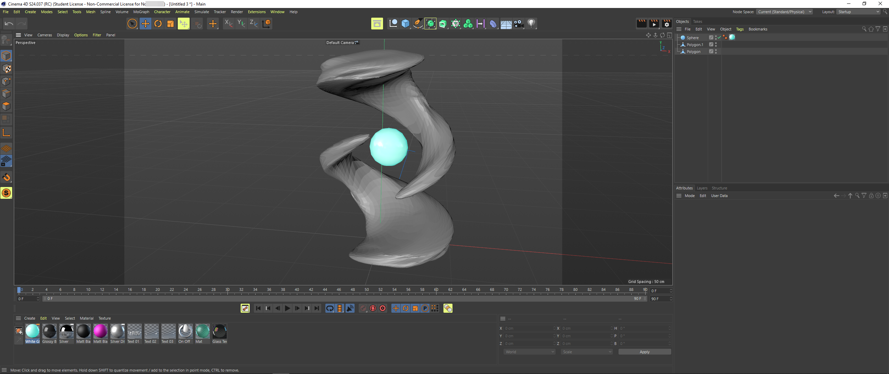

# 3D Objects

## About this demo

Initially we wanted to make a whole 3D experience with Three.js.  
We looked into C4D and modeling and started to make and export some test objects and imported them into Three.js. We used the demo from [threejs.org](https://threejs.org/editor/) to try and import our models and work out the initial bugs.  

The models in this demo folder are the ones that were successfully imported.