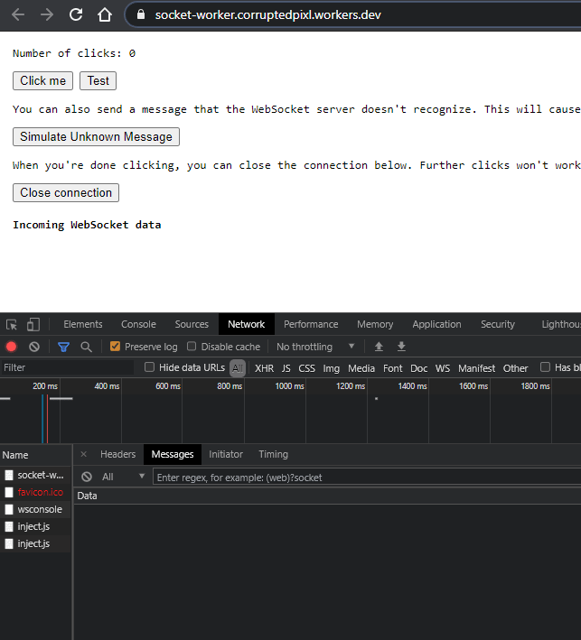

# Cloudflare workers Websocket Demo



This demo showcases using cloudflare workers as instant, stateless websocket servers.  
Using Cloudflare Workers as a websocket server that's always instantly available, we wanted to us this to communicate between the app and the external console.

Wile learning about Workers, KV and (Unique) Dynamic Objects, it came to our attention that DO were a paid (beta) feature, not available to us. We reached out for beta access but were sadly denied.

While Workers, combined with Dynamic Objects would be a killer stack, especially for near instant communication straight from Cloudflare's edges, this was just not possible for this project.

We opted for a standard heroku server instead running express. You can check out that demo at `DEMO/express-websocket-server`.

A live version of this very worker is available at [https://socket-worker.corruptedpixl.workers.dev/](https://socket-worker.corruptedpixl.workers.dev/)

## Try it yourself

To get a local copy up and running follow these steps.

### Prerequisites

For this demo, you'll need a few different tools and services.

We'll assume you have a [Cloudflare account](https://dash.cloudflare.com/sign-up/) and have your Zone ID and Account ID handy. You'll need these shortly.

Install Wrangler if you haven't already ([or follow this handy guide](https://developers.cloudflare.com/workers/get-started/guide))

### Installation

1. Clone the repo
   ```sh
   git clone https://github.com/CorruptedPixl/integration4.git
   ```
2. Navigate to folder and install packages
   ```sh
   cd DEMO/mouse-parallax && yarn
   ```
3. Authorize Wrangler

   ```sh
   wrangler login
   ```

   Follow the instructions in the terminal and log in.

4. Input your keys

   ```toml
   account_id = "YOUR_ACCOUNT_ID"
   zone_id = "YOUR_ZONE_ID"
   ```

   Replace with your Zone and Account ID in the wrangler.toml file now.

5. Init project

   ```sh
   wrangler init
   ```

   This will initialize the project from the pre-existing wrangler.toml file.

6. Publish worker
   ```sh
   wrangler publish
   ```
   Wrangler will compile with webpack and publish to your workers dev domain.

You're good to go. Have fun!

_This demo is based on a Cloudflare blog post. [Check out the blog post to learn more.](https://blog.cloudflare.com/introducing-websockets-in-workers/)_
